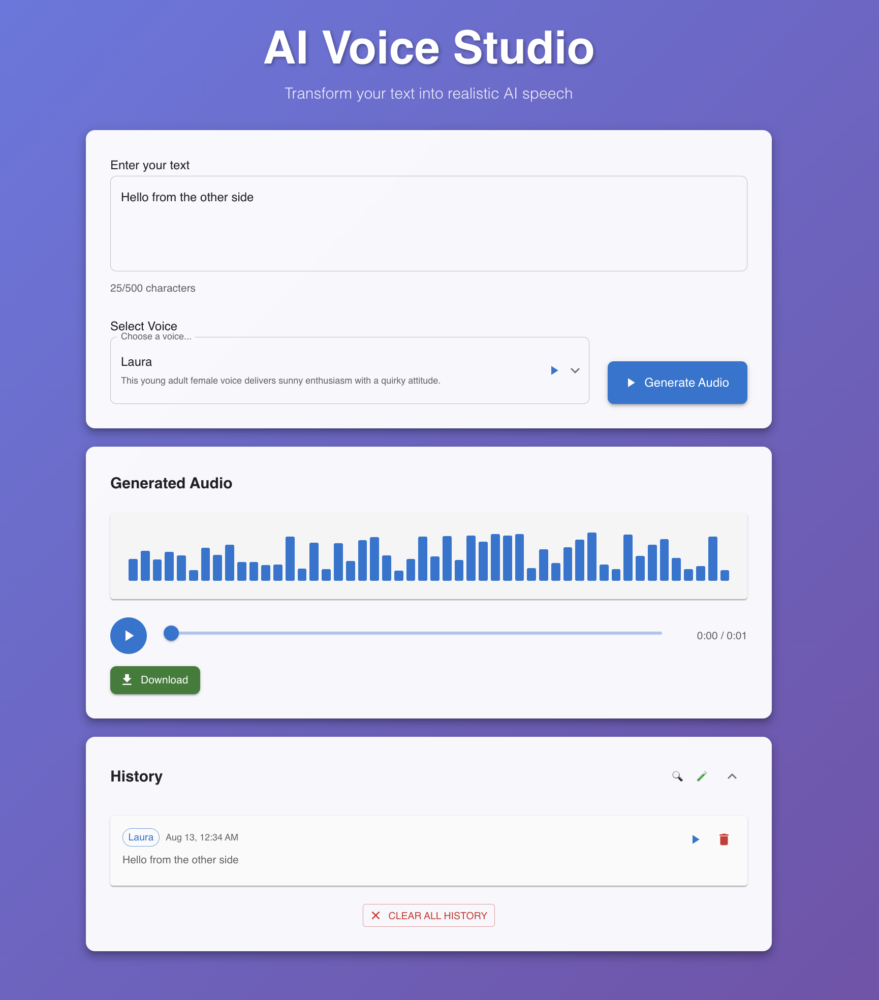

# 🎤 AI Voice Studio

A modern, responsive web application for AI-powered text-to-speech conversion using ElevenLabs API. Built with Next.js, TypeScript, and Material-UI.


## ✨ Features

### 🎯 Core Functionality
- **Text Input**: 500-character limit with live character count
- **Voice Selection**: 5 pre-fetched ElevenLabs voices with preview functionality
- **Audio Generation**: Real-time audio synthesis with loading states
- **Audio Player**: Waveform visualization with play/pause/download controls
- **History Management**: Stores last 10 generated audios in localStorage

### 🎨 User Experience
- **Modern UI**: Clean, responsive design with Material-UI components
- **Real-time Feedback**: Loading spinners, progress indicators, and error handling
- **Voice Previews**: Listen to voice samples before generation
- **Persistent Storage**: Automatic saving and restoration of generated content
- **Responsive Design**: Works seamlessly on desktop and mobile devices

### 🔧 Technical Features
- **TypeScript**: Full type safety and better development experience
- **API Integration**: ElevenLabs SDK with fallback mock system
- **Error Handling**: Comprehensive error management and user feedback
- **Performance**: Optimized builds and efficient state management
- **Portfolio Ready**: Safe for deployment with mock data fallback

## 🚀 Quick Start

### Prerequisites
- Node.js 18+ 
- npm or yarn
- ElevenLabs API key (optional, for real API usage)

### Installation

1. **Clone the repository**
   ```bash
   git clone <your-repo-url>
   cd ai-voice-studio
   ```

2. **Install dependencies**
   ```bash
   npm install
   ```

3. **Environment Setup** (Optional)
   ```bash
   cp env.example .env.local
   # Add your ElevenLabs API key to .env.local
   ```

4. **Generate Mock Audio** (For portfolio/demo)
   ```bash
   npm run generate-mock-audio
   ```

5. **Start Development Server**
   ```bash
   npm run dev
   ```

6. **Open your browser**
   ```
   http://localhost:3000
   ```

## 📁 Project Structure

```
ai-voice-studio/
├── src/
│   ├── app/                    # Next.js App Router
│   │   ├── api/               # API routes
│   │   │   ├── generate/      # Audio generation endpoint
│   │   │   └── voices/        # Voice fetching endpoint
│   │   ├── globals.css        # Global styles
│   │   ├── layout.tsx         # Root layout
│   │   └── page.tsx           # Main application page
│   ├── components/            # Reusable UI components
│   │   ├── AudioPlayer.tsx    # Audio playback component
│   │   ├── GenerateButton.tsx # Generation trigger
│   │   ├── HistoryTab.tsx     # History management
│   │   ├── TextInput.tsx      # Text input with validation
│   │   └── VoiceSelector.tsx  # Voice selection dropdown
│   ├── lib/                   # Utility libraries
│   │   ├── api.ts            # ElevenLabs API integration
│   │   ├── services.ts       # Service layer abstraction
│   │   └── storage.ts        # LocalStorage management
│   └── types/                # TypeScript type definitions
│       └── index.ts          # Application types
├── public/                   # Static assets
│   ├── mock-audio-*.mp3      # Generated mock audio files
│   └── *.svg                 # Icon assets
├── scripts/                  # Build utilities
│   └── generate-mock-audio.js # Mock audio generation script
└── package.json              # Dependencies and scripts
```

## 🎮 Usage

### Basic Workflow
1. **Enter Text**: Type or paste your text (max 500 characters)
2. **Select Voice**: Choose from available voices and preview them
3. **Generate Audio**: Click the generate button and wait for processing
4. **Play & Download**: Use the audio player to listen or download
5. **View History**: Access previously generated audio in the history tab

### Voice Preview
- Click the play button next to any voice to hear a sample
- Previews use actual ElevenLabs voice samples
- Supports multiple languages and accents

### History Management
- Automatically saves last 10 generated audios
- Persistent across browser sessions
- Individual item deletion and bulk clear options
- Audio playback directly from history

## ⚙️ Configuration

### Environment Variables
```bash
# .env.local
NEXT_PUBLIC_ELEVENLABS_API_KEY=your_api_key_here
ELEVENLABS_API_KEY=your_api_key_here
```

### Mock Mode
The application runs in mock mode by default for portfolio safety:
- Uses pre-generated mock audio files
- No API calls to ElevenLabs
- Safe for public deployment
- Realistic voice names and descriptions

### Real API Mode
To enable real ElevenLabs API:
1. Set your API key in `.env.local`
2. Modify `useMock` flags in API routes
3. Ensure you have sufficient API credits

## 🎨 Customization

### Material-UI Theme
Customize the theme in `src/app/page.tsx`:

```typescript
const theme = createTheme({
  palette: {
    primary: {
      main: '#1976d2',
    },
    secondary: {
      main: '#dc004e',
    },
  },
  // Add more theme customizations
});
```

### Voice Selection
Modify available voices in `src/app/api/voices/route.ts`:
- Add/remove voice IDs
- Update voice descriptions
- Change preview URLs

### History Settings
Adjust history behavior in `src/lib/storage.ts`:
- Change maximum history items
- Modify storage key names
- Add custom storage policies

## 🚀 Deployment

### Vercel (Recommended)
1. Connect your GitHub repository
2. Set environment variables in Vercel dashboard
3. Deploy automatically on push

### Other Platforms
- **Netlify**: Compatible with Next.js static export
- **Railway**: Full-stack deployment support
- **Docker**: Containerized deployment available

### Build Commands
```bash
npm run build    # Production build
npm run start    # Production server
npm run lint     # Code linting
```

## 🔧 Development



### Available Scripts
```bash
npm run dev              # Development server
npm run build           # Production build
npm run start           # Production server
npm run lint            # ESLint checking
npm run generate-mock-audio  # Generate mock audio files
```

### Code Quality
- **TypeScript**: Strict type checking enabled
- **ESLint**: Code quality and style enforcement
- **Prettier**: Automatic code formatting
- **Material-UI**: Consistent component library

## 🐛 Troubleshooting

### Common Issues
1. **Mock Audio Not Playing**: Ensure mock files are generated
2. **API Errors**: Check environment variables and API key
3. **Build Failures**: Verify TypeScript types and imports
4. **Storage Issues**: Clear browser localStorage if needed

### Debug Mode
Enable debug logging by modifying console statements in:
- `src/lib/storage.ts`
- `src/app/api/` routes
- Component files

## 📝 License

This project is open source and available under the [MIT License](LICENSE).

## 🙏 Acknowledgments

- **ElevenLabs**: For providing the text-to-speech API
- **Material-UI**: For the excellent component library
- **Next.js**: For the powerful React framework
- **TypeScript**: For type safety and developer experience

---

**Ready for Portfolio!** 🎉 This project is production-ready with comprehensive features, clean code, and professional documentation.
